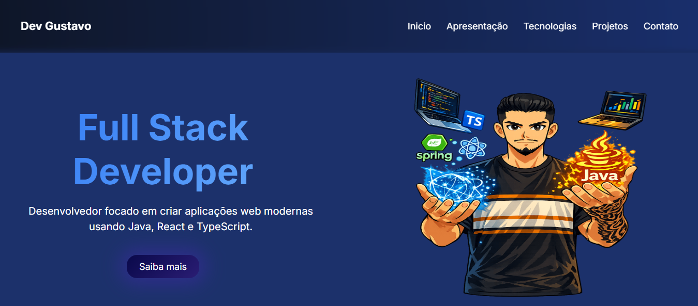

# Portfólio - Gustavo Corrêa

Bem-vindo ao meu portfólio.  
Este projeto foi desenvolvido para apresentar meus trabalhos, habilidades e minha evolução como desenvolvedor.

---

## Sobre o projeto

Este website tem como objetivo centralizar meus projetos, destacar minhas competências e facilitar o contato profissional.

Aqui você encontrará:

- Projetos desenvolvidos por mim
- Tecnologias que utilizo
- Informações para contato

---

## Tecnologias utilizadas

- React
- TypeScript
- HTML
- Vite
- CSS

---

## Responsividade

Atualmente, o site ainda não é responsivo.  
A adaptação para dispositivos móveis será implementada em breve como parte da evolução do projeto.

---

## Funcionalidades

- Apresentação pessoal
- Seção de projetos
- Navegação simples
- Seção de contato

---

## Deploy

O projeto está disponível em:

(https://portfolio-website-swart-theta-30.vercel.app/#inicio)

---

## Preview

---

## Contato

- Email: gustavocorreaa11@gmail.com  
- LinkedIn: https://www.linkedin.com/in/gustavo-correa11/ 
- GitHub: https://github.com/GustavoCorrea10

---

## Objetivo

Este portfólio faz parte da minha jornada na área de tecnologia, com foco em evolução constante e aprendizado contínuo.

---

Obrigado por visitar meu portfólio.